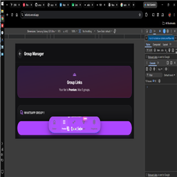

# Wazle

**The official mobile companion for Wazle Automation**

---

## The Story of Wazle

Every great journey begins with a single step, and for us, that step was born out of a simple necessity: *How do we make WhatsApp automation feel less like a machine, and more like magic?*

Once known as Netals (and briefly stepping into the world as Antarac), we realized that our identity needed to evolve just as our technology did. We wanted a name that rolled off the tongue, a name that sounded as fast, dynamic, and reliable as the service we provide. Thus, **Wazle** was born. 

Wazle isn't just an application; it's the culmination of countless hours of imagining a better way for managers, business owners, and community leaders to interact with their digital ecosystems. It is your bridge, your command center, and your silent partner that works tirelessly in the background.

With Wazle, you are no longer chained to a desktop to manage your bots. We have crafted a clean, distraction-free mobile experience where you can craft auto-responses, explore files, check your server's pulse, and command your WhatsApp empire. all from the palm of your hand.

---

## What Makes Wazle Special?

- **Command at Your Fingertips:** Your WhatsApp bot is now a mobile resident. Connect, monitor, and command it anywhere.
- **The Responder Studio:** A creative canvas for designing complex conversational flows and decision trees. Let your bot do the talking, intelligently.
- **File Explorer Magic:** Seamlessly browse and manage files linked to your bot's brain, powered silently by Google Drive.
- **The Group Overseer:** Keep a watchful eye over your WhatsApp group members, statistics, and invitation links without breaking a sweat.
- **Pulse of the Server:** Feel the heartbeat of your VPS with real-time CPU, RAM, and uptime tracking. 
- **Focus & Flow:** Immersive, full-screen, and distraction-free interface, complete with a built-in Focus Music player to keep you in the zone.

---

## Experience the Magic

> **Beta v0.2.** The journey continues. Now featuring a Focus Music Player & a 00:00 Notification Engine.

[Download Wazle APK (Beta v0.2)](./Wazle-beta-v0.2.apk)

*(Note: We are in the process of renaming our core files, but the magic inside remains the same!)*

---

## License

This journey is shared under the [MIT License](./LICENSE).

Copyright © 2026 **Wazle**

---

## Forged by

**Wazle**
*Bringing soul and intelligence to WhatsApp automation.*

---
---

# Wazle: Sebuah Cerita Baru (Versi Indonesia)

---

## Kisah Terlahirnya Wazle

Setiap perjalanan besar selalu dimulai dari satu langkah kecil. Bagi kami, langkah itu lahir dari sebuah pertanyaan sederhana: *Bagaimana caranya membuat otomasi WhatsApp tidak lagi terasa seperti robot kaku, melainkan seperti sebuah keajaiban?*

Dulu, Anda mungkin mengenal kami sebagai Netals, atau bahkan sempat menyapa kami sebagai Antarac. Namun, seiring berkembangnya teknologi kami, kami sadar bahwa identitas kami pun harus ikut berevolusi. Kami menginginkan nama yang lincah, modern, dan mudah diingat. Nama yang mencerminkan kecepatan dan keandalan layanan kami. Dari sanalah, **Wazle** lahir.

Wazle bukanlah sekadar aplikasi. Ini adalah wujud dari dedikasi tanpa henti untuk menciptakan cara yang lebih baik bagi para manajer, pemilik bisnis, dan pemimpin komunitas dalam mengelola ekosistem digital mereka. Wazle adalah jembatan Anda, pusat komando Anda, dan rekan kerja diam-diam yang tak kenal lelah beroperasi di balik layar.

Kini, Anda tidak perlu lagi terpaku di depan layar komputer. Kami merancang pengalaman mobile yang bersih, imersif, dan bebas gangguan. Di Wazle, Anda bisa meracik balasan otomatis, menjelajahi file, memeriksa detak jantung server Anda, dan memimpin kerajaan WhatsApp Anda. semuanya hanya dari genggaman tangan.

---

## Apa yang Membuat Wazle Istimewa?

- **Komando di Ujung Jari:** Bot WhatsApp Anda kini hidup di ponsel Anda. Hubungkan, pantau, dan kendalikan dari mana saja.
- **Responder Studio:** Kanvas kreatif untuk merancang alur percakapan yang cerdas dan kompleks. Biarkan bot Anda berbicara dengan gaya.
- **Keajaiban File Explorer:** Akses dan kelola file yang terhubung ke otak bot Anda secara mulus, didukung oleh kekuatan Google Drive.
- **Pengawas Grup (Group Manager):** Pantau anggota grup WhatsApp, statistik, dan tautan undangan tanpa harus memeras keringat.
- **Detak Jantung Server:** Rasakan denyut nadi VPS Anda dengan pemantauan CPU, RAM, dan waktu aktif (uptime) secara real-time.
- **Fokus & Mengalir:** Antarmuka layar penuh yang bebas gangguan, lengkap dengan pemutar *Focus Music* bawaan untuk menemani Anda bekerja.

---

## Rasakan Keajaibannya

> **Beta v0.2.** Perjalanan berlanjut. Kini dilengkapi dengan Focus Music Player & Mesin Notifikasi 00:00.

[Unduh Wazle APK (Beta v0.2)](./Wazle-beta-v0.2.apk)

*(Catatan: Kami sedang dalam proses mengubah nama file inti kami, namun keajaiban di dalamnya tetap sama!)*

---

## Lisensi

Perjalanan ini dibagikan di bawah [MIT License](./LICENSE).

Hak Cipta © 2026 **Wazle**

---

## Ditempa oleh

**Wazle**
*Membawa jiwa dan kecerdasan ke dalam otomasi WhatsApp.*

